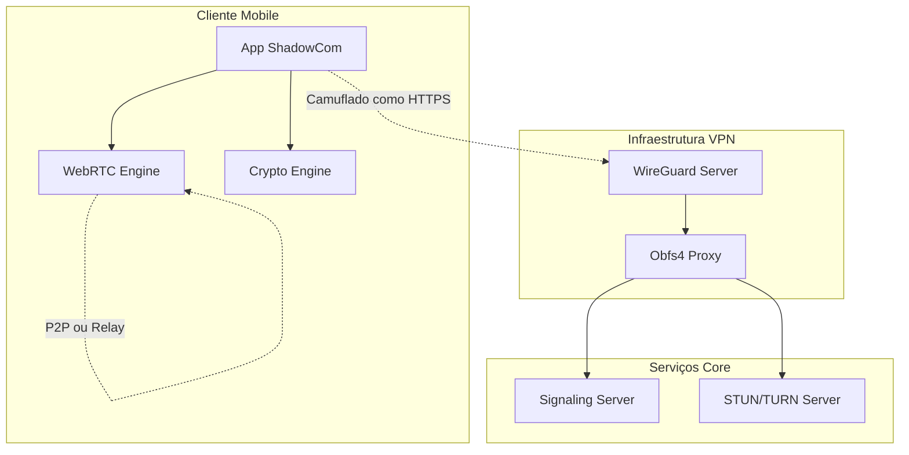
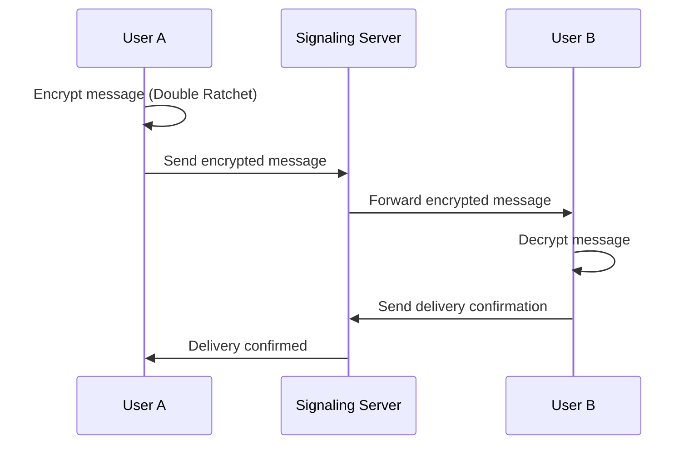
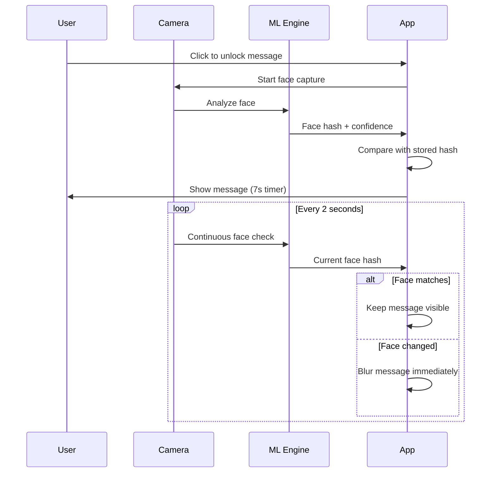

# 🏗️ ShadowCom - Arquitetura Técnica

## 📋 Visão Geral

O ShadowCom é composto por 5 componentes principais que trabalham em conjunto para fornecer comunicação segura e camuflada:



---

## 🔐 Camadas de Segurança

### Camada 1: Criptografia de Comunicação
- **SRTP**: Secure Real-Time Protocol para voz
- **ZRTP/DTLS**: Troca de chaves efêmeras
- **Curve25519 + X3DH**: Derivação de sessão
- **libsodium**: Base criptográfica

### Camada 2: Tunelamento e Camuflagem
- **WireGuard**: VPN base com porta TCP/443
- **Obfs4/Shadowsocks**: Ofuscação de tráfego
- **Domain fronting**: Camuflagem adicional (opcional)

### Camada 3: Identidade e Autenticação
- **Curve25519**: Chaves únicas por usuário
- **QR/ID/Fingerprint**: Identificação segura
- **Modo anônimo**: Sem dados pessoais

---

## 📱 Arquitetura do App Mobile

### Stack Tecnológico
```
┌─ React Native (UI Layer)
├─ WebRTC (react-native-webrtc)
├─ Crypto (libsodium / react-native-sodium)
├─ Signal Protocol (react-native-signal-protocol)
├─ Biometrics (react-native-biometrics)
└─ Camera/MLKit (react-native-vision-camera + MLKit)
```

### Fluxo de Dados
```
[UI] ↔ [State Management] ↔ [Business Logic]
 ↓                           ↓
[Crypto Engine]         [Network Layer]
 ↓                           ↓
[Storage (Encrypted)]   [VPN Tunnel]
```

---

## 🔧 Servidor de Sinalização

### Tecnologia
- **Node.js + Socket.IO** ou **Go + gRPC**
- **Redis**: Cache de sessões
- **PostgreSQL**: Registro de chaves públicas (opcional)

### Responsabilidades
1. **Handshake**: Estabelecer conexões entre pares
2. **Key Exchange**: Intermediar troca de chaves (sem acesso ao conteúdo)
3. **User Registry**: Registrar IDs de usuários
4. **Session Management**: Gerenciar sessões ativas

### API Endpoints
```
WebSocket/gRPC:
├─ /connect          # Estabelecer conexão
├─ /signal           # Sinalização WebRTC
├─ /key-exchange     # Troca de chaves
├─ /user-register    # Registro de usuário
└─ /user-lookup      # Busca de usuários
```

---

## 🌐 Infraestrutura STUN/TURN

### Software: coturn
```
turnserver.conf:
├─ listening-port=3478
├─ tls-listening-port=5349
├─ min-port=10000
├─ max-port=20000
├─ use-auth-secret
├─ static-auth-secret=<secret>
├─ realm=shadowcom.local
└─ cert=/path/to/cert.pem
```

### Funções
- **NAT Traversal**: Permitir conexões P2P através de NATs
- **Relay Fallback**: Quando P2P não é possível
- **Load Balancing**: Distribuir carga entre servidores

---

## 🔒 Infraestrutura VPN

### WireGuard Configuration
```ini
[Interface]
PrivateKey = <server-private-key>
Address = 10.0.0.1/24
ListenPort = 51820
PostUp = iptables -A FORWARD -i %i -j ACCEPT
PostDown = iptables -D FORWARD -i %i -j ACCEPT

[Peer]
PublicKey = <client-public-key>
AllowedIPs = 10.0.0.2/32
```

### Obfuscation Layer (Obfs4)
```
Client → Obfs4 Proxy → WireGuard → Internet
Port 443   (Hidden)    (Encrypted)
```

### Multi-Region Setup
```
Regions:
├─ US East (Primary)
├─ Europe West (Secondary)
├─ Asia Pacific (Backup)
└─ South America (Backup)
```

---

## 🔄 Fluxos de Comunicação

### 1. Estabelecimento de Chamada
```mermaid
sequenceDiagram
    participant A as User A
    participant V as VPN Server
    participant S as Signaling Server
    participant T as TURN Server
    participant B as User B

    A->>V: Connect via WireGuard
    A->>S: Request call to User B
    S->>B: Incoming call notification
    B->>S: Accept call
    S->>A: Call accepted
    A<-->B: Exchange ICE candidates via S
    A<-->T: STUN/TURN for NAT traversal
    A<-->B: Direct P2P connection (SRTP)
```

### 2. Troca de Mensagens


### 3. Verificação Facial Contínua


---

## 💾 Estrutura de Dados

### User Identity
```json
{
  "userId": "curve25519-public-key-hex",
  "displayName": "Optional display name",
  "publicKey": "curve25519-public-key",
  "preKeys": ["array", "of", "one-time-keys"],
  "signedPreKey": "signed-pre-key",
  "identityKey": "long-term-identity-key",
  "fingerprint": "derived-fingerprint"
}
```

### Message Structure
```json
{
  "messageId": "uuid",
  "senderId": "sender-user-id",
  "recipientId": "recipient-user-id",
  "timestamp": 1234567890,
  "encryptedContent": "base64-encrypted-content",
  "messageType": "text|voice|file",
  "ephemeralTimer": 3600,
  "doubleRatchetHeader": {
    "dh": "diffie-hellman-public-key",
    "pn": "previous-chain-length",
    "n": "message-number"
  }
}
```

### Session Data
```json
{
  "sessionId": "uuid",
  "participants": ["user-id-1", "user-id-2"],
  "sessionType": "voice|message",
  "createdAt": 1234567890,
  "expiresAt": 1234567890,
  "encryptionKeys": {
    "rootKey": "encrypted-root-key",
    "chainKey": "encrypted-chain-key"
  },
  "isActive": true
}
```

---

## 🚀 Deployment Architecture

### Production Environment
```
Load Balancer (Cloudflare)
├─ VPN Servers (Multiple Regions)
│  ├─ WireGuard + Obfs4
│  └─ Health Monitoring
├─ Signaling Servers (Auto-scaled)
│  ├─ Node.js Cluster
│  └─ Redis Session Store
└─ STUN/TURN Servers
   ├─ coturn Instances
   └─ Geographic Distribution
```

### Monitoring Stack
```
Monitoring:
├─ Prometheus (Metrics)
├─ Grafana (Dashboards)
├─ ELK Stack (Logs)
└─ Alertmanager (Alerts)
```

---

## 🔧 Development Environment

### Local Setup
```bash
# VPN Server (Docker)
docker run -d --name wireguard \
  --cap-add=NET_ADMIN \
  --cap-add=SYS_MODULE \
  -p 51820:51820/udp \
  linuxserver/wireguard

# Signaling Server
cd signaling-server
npm install
npm run dev

# TURN Server
cd stun-turn-server
docker-compose up -d

# Mobile App
cd mobile-app
npx react-native run-android
```

### Testing Environment
```
Testing Stack:
├─ Jest (Unit Tests)
├─ Detox (E2E Tests)
├─ Wireshark (Network Analysis)
└─ OWASP ZAP (Security Tests)
```

---

## 📊 Performance Specifications

### Target Metrics
- **Call Setup Time**: < 3 seconds
- **Audio Latency**: < 150ms
- **Bandwidth Usage**: 64-128 kbps per call
- **Battery Impact**: < 5% per hour of usage
- **Connection Success**: > 95% under normal conditions

### Scalability
- **Concurrent Users**: 10,000+ per signaling server
- **Messages/Second**: 1,000+ per signaling server
- **Geographic Regions**: 5+ for global coverage
- **Failover Time**: < 30 seconds

---

*Esta arquitetura garante comunicação segura, privada e resistente à vigilância, mantendo alta performance e usabilidade.* 